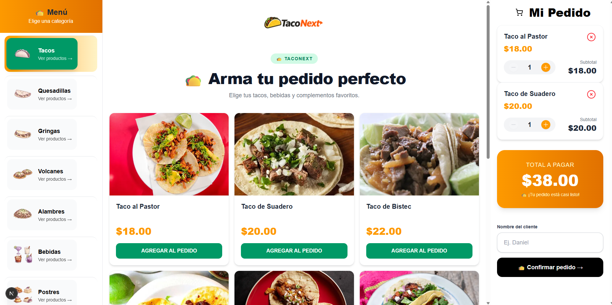
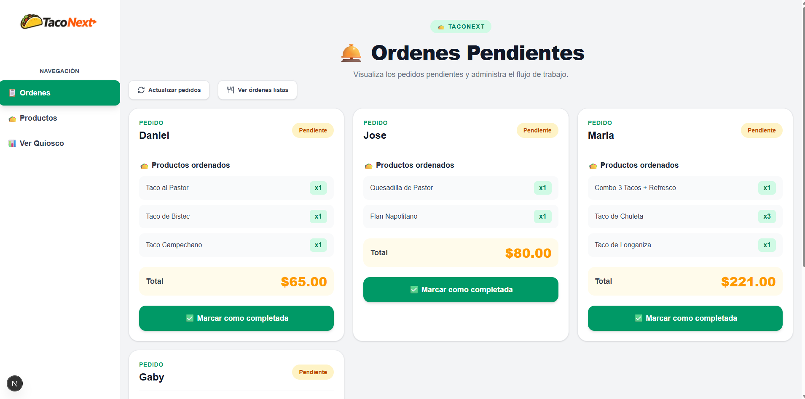
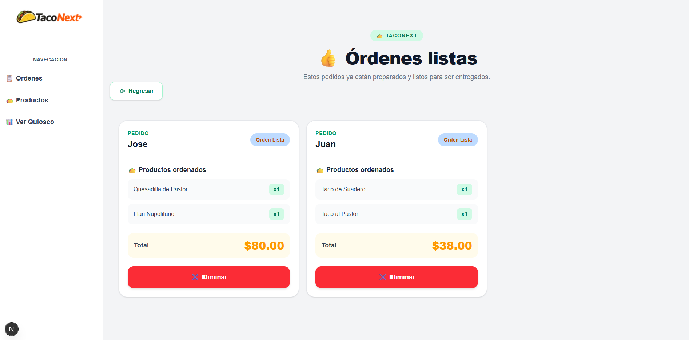
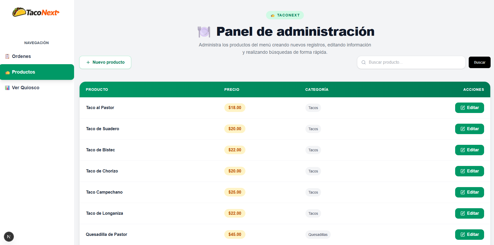
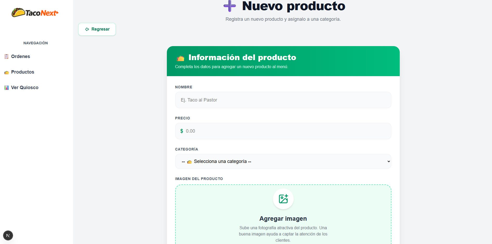
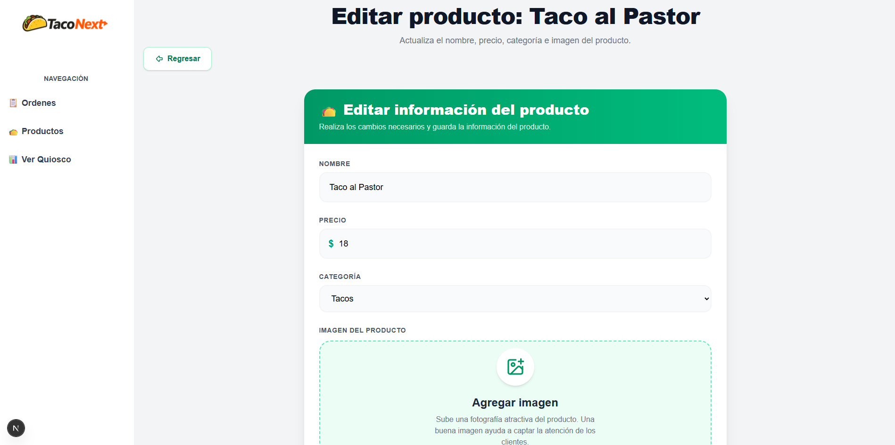
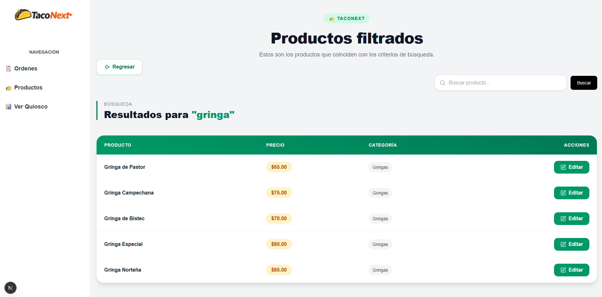

<p align="center">


</p>

---

# 🌮 TacoNext

## Aplicación web para la gestión de pedidos y administración de productos de una taquería, desarrollada con Next.js, Prisma, PostgreSQL y Cloudinary.

## 🌐 Demo

Puedes probar la aplicación desplegada aquí:

---

🔗 **Live Demo:** https://taco-next.vercel.app/order/tacos

## 🚀 Tecnologías

### Frontend
- Next.js 16
- React 19
- TypeScript
- Tailwind CSS 4

### Backend
- Next.js Server Actions
- Prisma ORM
- PostgreSQL

### Almacenamiento
- Cloudinary

### Librerías
- Zustand
- Zod
- React Toastify
- Lucide React
- Heroicons

### Herramientas
- ESLint
- PostCSS

---









---

## 🚀 Instalación y configuración

### 1. Clonar el repositorio

```bash
git https://github.com/daniel-mena2000/TacoNext.git
```

### 2. Entrar al proyecto

```bash
cd taconext
```

### 3. Instalar dependencias

```bash
npm install
```

### 4. Configurar las variables de entorno

Crea un archivo `.env` y agrega las siguientes variables:

```env
DATABASE_URL=
NEXT_PUBLIC_CLOUDINARY_CLOUD_NAME=
NEXT_PUBLIC_CLOUDINARY_API_KEY=
CLOUDINARY_API_SECRET=
```

### 5. Ejecutar las migraciones

```bash
npx prisma migrate deploy
```

o si es desarrollo:

```bash
npx prisma migrate dev
```

### 6. Poblar la base de datos (si aplica)

```bash
npm run seed
```

### 7. Ejecutar el proyecto

```bash
npm run dev
```

La aplicación estará disponible en:

```
http://localhost:3000
```
